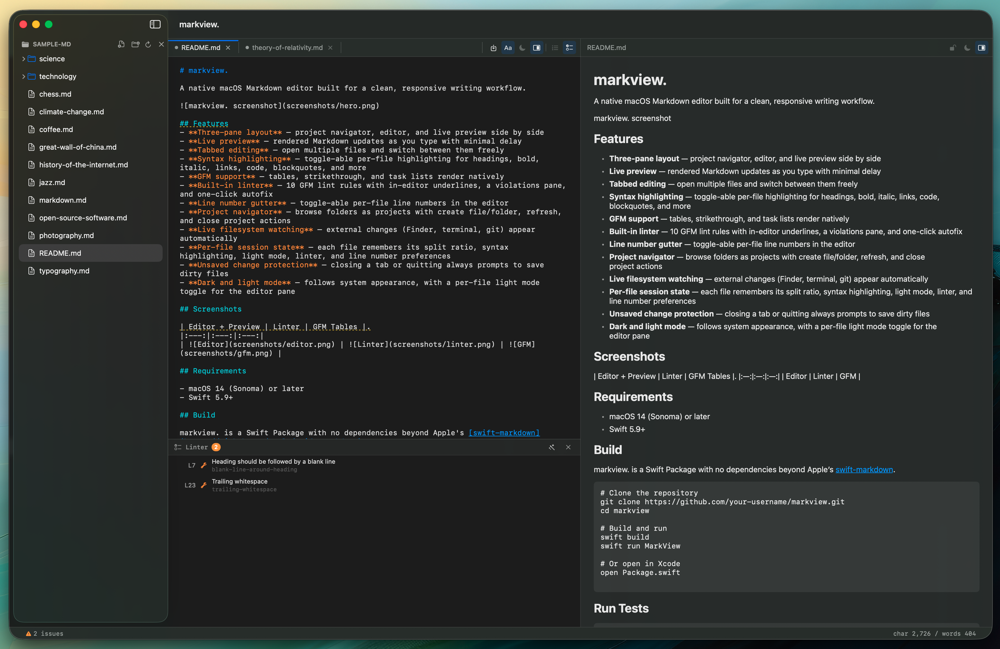
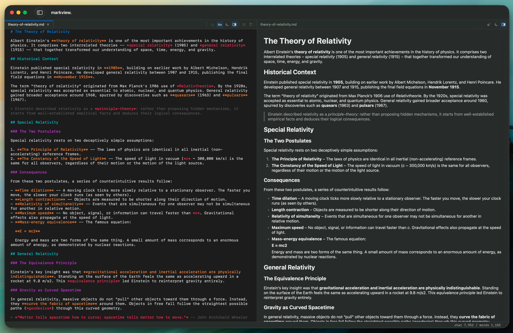
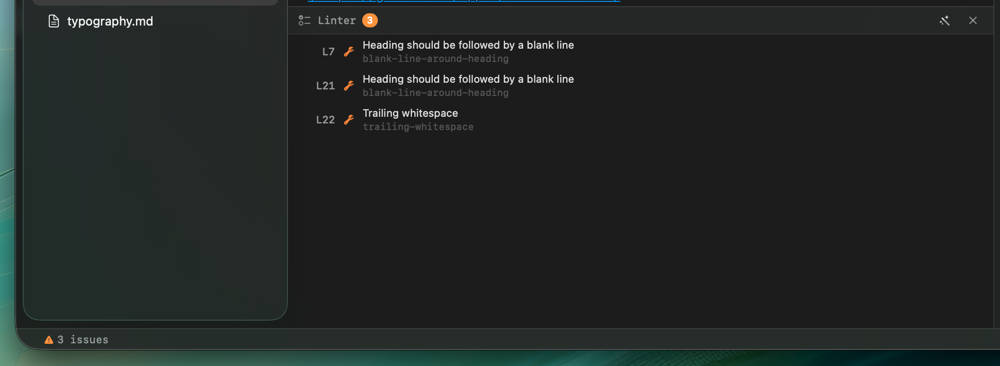
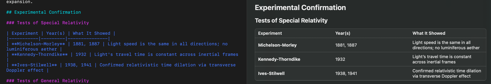

# markview.

A native macOS Markdown editor built for a clean, responsive writing workflow.



## Features

- **Three-pane layout** — project navigator, editor, and live preview side by side
- **Live preview** — rendered Markdown updates as you type with minimal delay
- **Tabbed editing** — open multiple files and switch between them freely
- **Syntax highlighting** — toggle-able per-file highlighting for headings, bold, italic, links, code, blockquotes, and more
- **GFM support** — tables, strikethrough, and task lists render natively
- **Built-in linter** — 10 GFM lint rules with in-editor underlines, a violations pane, and one-click autofix
- **Line number gutter** — toggle-able per-file line numbers in the editor
- **Project navigator** — browse folders as projects with create file/folder, refresh, and close project actions
- **Live filesystem watching** — external changes (Finder, terminal, git) appear automatically
- **Per-file session state** — each file remembers its split ratio, syntax highlighting, light mode, linter, and line number preferences
- **Unsaved change protection** — closing a tab or quitting always prompts to save dirty files
- **Dark and light mode** — follows system appearance, with a per-file light mode toggle for the editor pane

## Screenshots

| Editor + Preview | Linter | GFM Tables |
|:---:|:---:|:---:|
|  |  |  |

## Requirements

- macOS 14 (Sonoma) or later

## Install

Download the latest `markview.app.zip` from [Releases](https://github.com/November-Zulu/markview/releases), unzip, and move to your Applications folder.

## Build from Source

markview. is a Swift Package with no dependencies beyond Apple's [swift-markdown](https://github.com/apple/swift-markdown). Requires Swift 5.9+.

```bash
# Clone the repository
git clone https://github.com/November-Zulu/markview.git
cd markview

# Build and run
swift build
swift run MarkView

# Or build the .app bundle
scripts/build-app.sh

# Or open in Xcode
open Package.swift
```

## Run Tests

```bash
swift test
```

## Sample Files

The `sample-md/` folder contains 20 markdown documents covering a range of topics and sizes — useful for testing the editor, renderer, and linter.

## Keyboard Shortcuts

| Shortcut | Action |
|----------|--------|
| `⌘O` | Open File |
| `⇧⌘O` | Open Folder |
| `⌘S` | Save |
| `⌘W` | Close Tab |
| `⌥⌘S` | Toggle Navigator |
| `⌥⌘P` | Toggle Preview |
| `⇧⌘L` | Toggle Linter |
| `⇧⌘N` | Toggle Line Numbers |

## Architecture

```
Sources/MarkView/
├── App/           # Entry point, main window, menus, delegates
├── Features/
│   ├── Navigator/ # Project file tree and action buttons
│   ├── Editor/    # Tab bar, text view, linter pane, line numbers
│   └── Preview/   # Live Markdown renderer
├── Models/        # Observable state: project, workspace, documents
├── Services/      # Filesystem I/O, Markdown parsing, highlighting, linting
├── UI/            # Design tokens
└── Resources/     # Info.plist
```

## License

[MIT](LICENSE)
